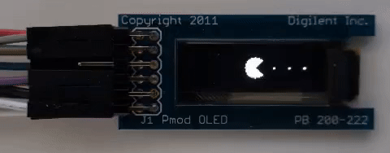
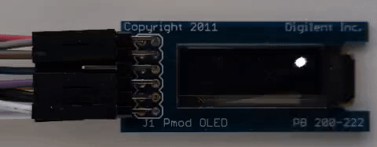
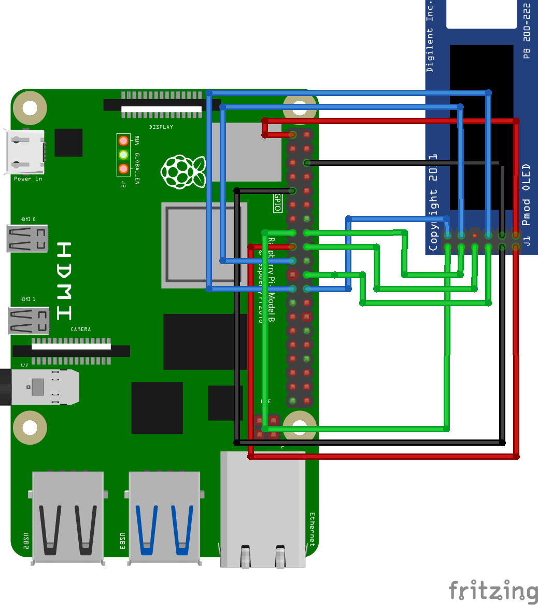
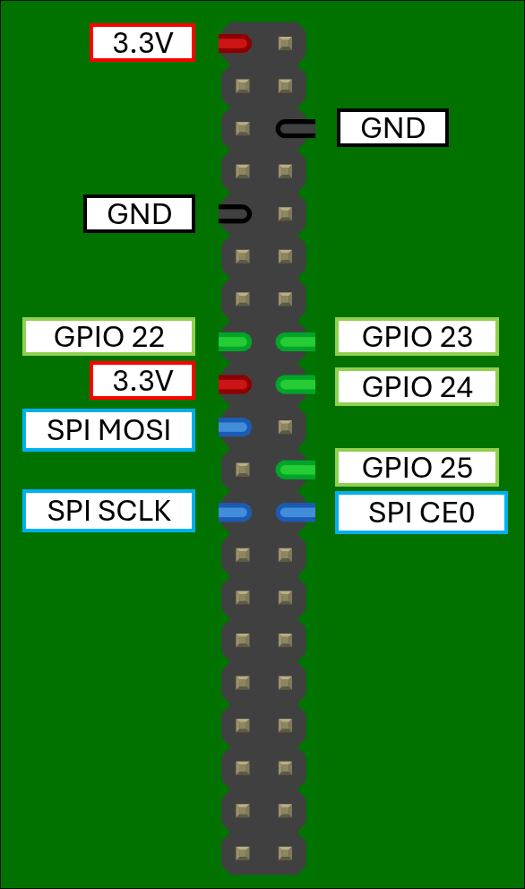
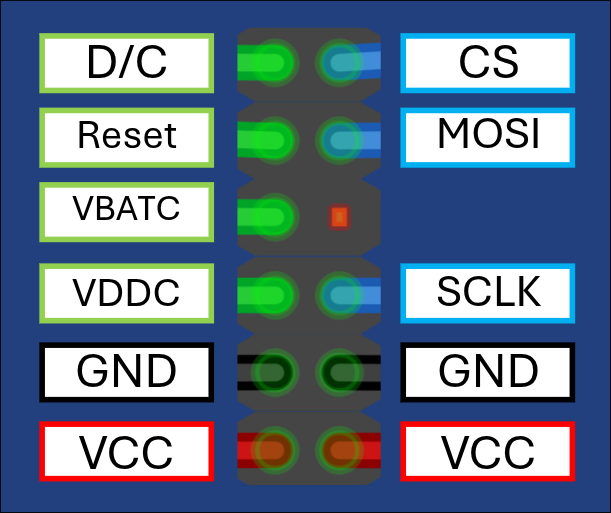

# OLED Screen WebAssembly Components

This directory contains examples of controlling an OLED display using WebAssembly (Wasm) components. It showcases the spi library, aswell as the composability of the component model.

## Architecture & Components

The folder contains of three distinct components:

1.  **`pmod-oled-driver` (The Driver)**
    This component handles the low-level hardware interactions. It communicates directly with the host's SPI and GPIO interfaces to control the display. It exposes a high-level `graphics` interface to other Wasm components, providing functions like `set-pixel`, `clear`, and `present`. It effectively abstracts the hardware away from the application logic.

2.  **`pacman` (The Application)**
    A pure software component that implements a Pacman animation logic. It depends on the `pmod-oled-driver` to actually visualize the game state. It does not know *how* to talk to SPI/GPIO; it simply asks the driver to "draw a pixel here."

    > **Demo:**
    >
    > 

3.  **`ball-screensaver` (The Application)**
    A physics simulation of a ball bouncing off the screen walls (similar to the classic DVD screensaver). Like Pacman, it relies entirely on the driver component for rendering.

    > **Demo:**
    >
    > 

## Hardware Setup

To run these demos, you will need the following hardware:

* **Host:** Raspberry Pi 4B
* **Peripheral:** Digilent Pmod OLED (128x32 Pixel Monochromatic OLED)

### Wiring Configuration

Connect the Pmod OLED to the Raspberry Pi GPIO pins as shown in the diagram below. You can wire them differently, but the policy file will need to change accordingly (see next section)




The wires are color coded in the following way:

- **red**: 3.3V power
- **black**: ground
- **green**: GPIO
- **blue**: SPI

The specific raspberry pi labels are given in the following diagram:





Here are the labels for the pmod oled screen. Notice the MISO pin is not connected, as the screen does not send data to the host:




## Security & Configuration: The Policy File

In the WebAssembly Component Model, guests are sandboxed by default. They cannot access system resources (like `/dev/spidev` or specific GPIO pins) unless explicitly granted permission.

To maintain security and portability, we use a TOML **Policy File** (e.g., `policies.toml`). This file maps the physical GPIO pins and spi devices to the virtual names the guest will be able to use. For more info on how to configure the GPIO pins though the policy file, see [the original repository](https://github.com/idlab-discover/wasi-gpio-implementations).

To map the spi devices to a virtual name use the following pattern in the policy file:

```toml
[wasi]

[[wasi.spi]]
physical_path = "/dev/spidev0.0"
virtual_name = "some_screen"

[[wasi.spi]]
physical_path = "/dev/spidev1.0"
virtual_name = "some_sensor"
```

This ensures that if the hardware wiring changes, you only need to update the policy file, not the compiled Wasm code.

## Running the Components

You can run these components using the provided helper scripts or by executing the steps manually to understand the process.

### Prerequisites

* **Rust & Cargo** (with `wasm32-wasip2` target installed)
* **WAC** (WebAssembly Compositions tool) to link components together.

### Option 1: Quick Start (Scripts)

We have provided shell scripts that handle building, composing, and running the host in one go:

```bash
# Run the Pacman demo
./run_pacman.sh

# Run the Bouncing Ball demo
./run_dvd.sh
```

### Option 2: Manual Step-by-Step Guide

If you want to understand the build lifecycle, here are the commands used inside the scripts:

#### 1. Build the Components
First, we compile the Rust code into WebAssembly components targeting WASI Preview 2. We must build both the driver and the application logic.

```bash
TARGET_DIR="target/wasm32-wasip2/release"

# Build the Driver
cargo build -p pmod-oled-driver --target wasm32-wasip2 --release

# Build the App (e.g., Pacman)
cargo build -p pacman --target wasm32-wasip2 --release
```

#### 2. Compose the Application
At this stage, we have two separate Wasm files. The `pacman.wasm` imports a graphics interface, and `pmod_oled_driver.wasm` exports it. We must "plug" them together to create a single binary.

```bash
# Plug the driver into the pacman app
wac plug "$TARGET_DIR/pacman.wasm" \
    --plug "$TARGET_DIR/pmod_oled_driver.wasm" \
    -o "$TARGET_DIR/pacman_final.wasm"
```

#### 3. Run the Host
Finally, we run the generic Host application, passing it our composed Wasm binary and policy file.

```bash
cargo run -p host -- \
  "$TARGET_DIR/pacman_final.wasm" \
  --policy-file "guests/oled-screen/policies.toml"
```

